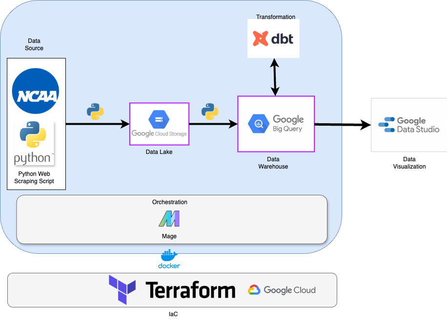
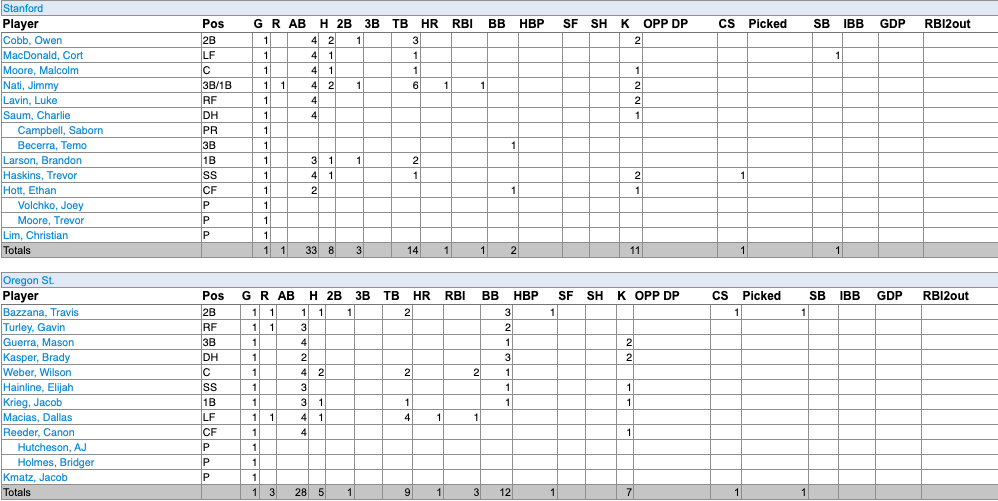
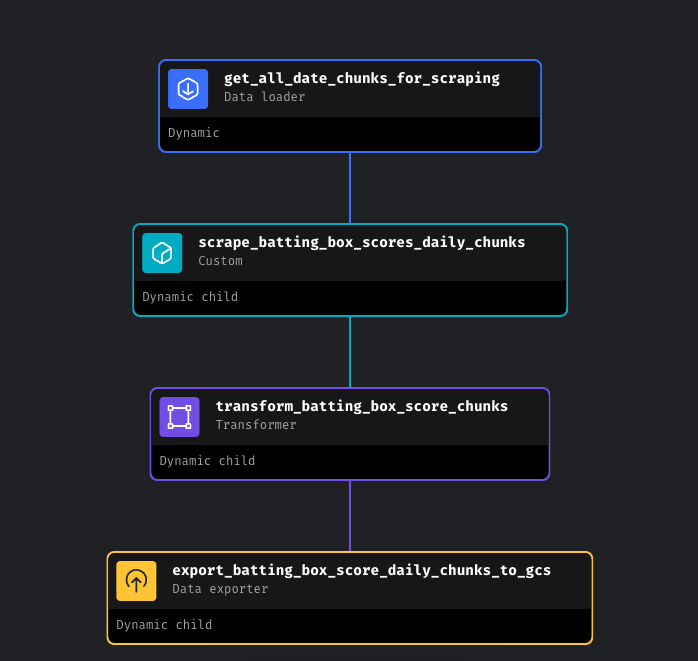
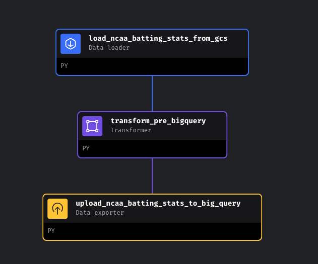
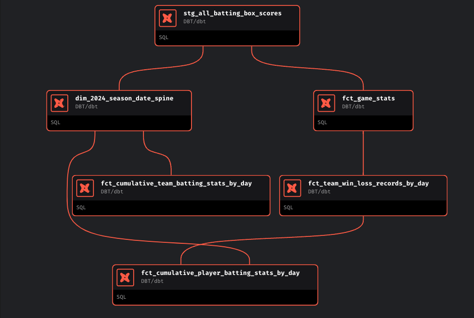
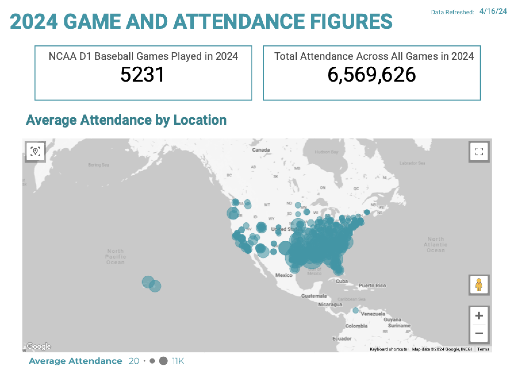
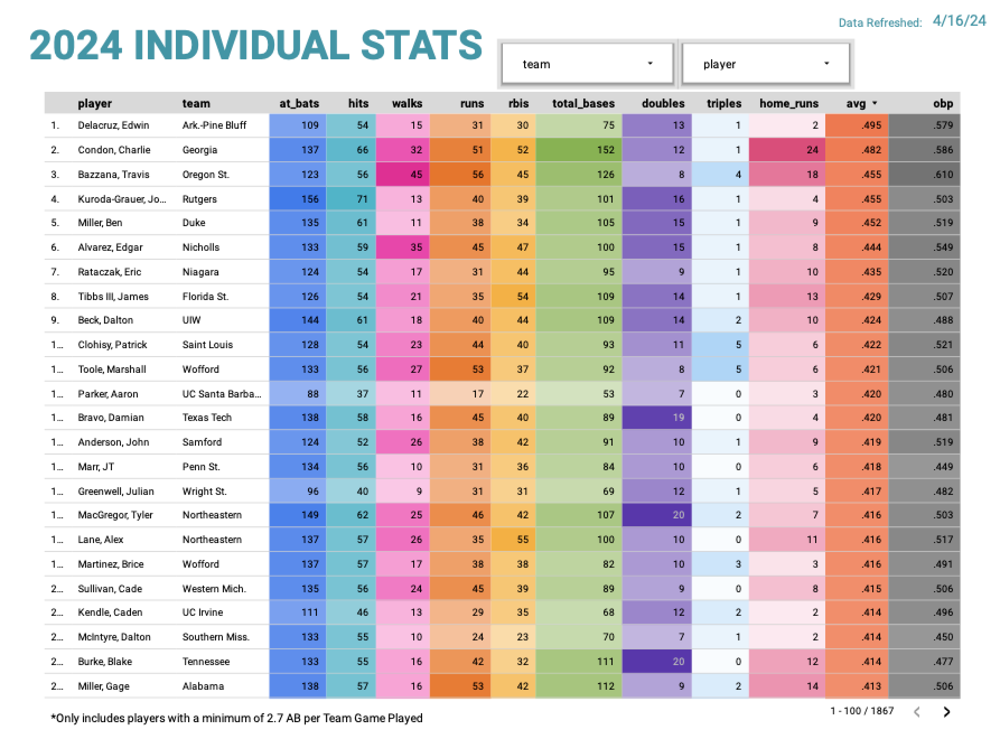
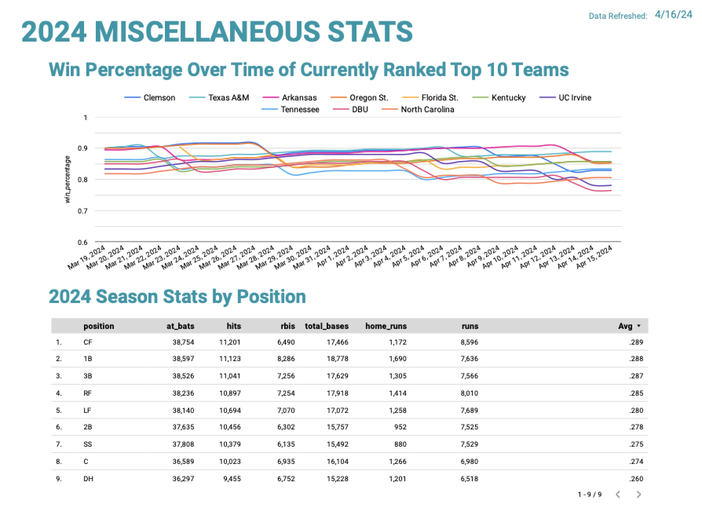

# NCAA D1 Baseball Stats - Data Engineering Zoomcamp Final Project

## **Overview**

An end to end data pipeline that scrapes, stores, transforms and visualizes stats from all 2024 NCAA D1 Baseball Games. This project was created to demonstrate concepts learned in the 2024 Data Engineering Zoomcamp hosted by the Data Talks Club as well as a fun personal project for me to build a database and tool that I wish had previously existed. Big thank you to the Data Talks Club for dedicating their time to putting this course together and helping people learn Data Engineering for free. 

If you want to go straight to reproducing this project, you can find detailed setup instructions [here](https://github.com/beaubranton4/ncaa_d1_baseball_stats/blob/main/setup.md).

## **Problem Statement**
  
 As a former college baseball player, I am a big fan of college baseball. I enjoy following the baseball team of my alma mater, staying up to date on players from where I grew up, and tracking the up and coming stars in the game who will undoubtedly play professionally one day. Although the NCAA does a great job of gathering stats from each game - there isn't a great central repository for visualizing college baseball stats that is easily searchable and filterable. I felt that I could take steps towards creating a solution to this problem through this project - and maybe uncover some interesting insights while I'm at it. And last, but certainly not least, learn about Data Engineering.

  ## **Objective**

Use [concepts learned in the course](https://github.com/DataTalksClub/data-engineering-zoomcamp/blob/main/README.md) to build an end-to-end data pipeline that will result in a dashboard to visualize stats and uncover insights from the NCAA D1 Baseball season. The project will include the following:

-   Selecting a dataset of interest (I chose to gather my data via webscraping)
-   Creating a pipeline for processing this dataset and transferring it to a datalake
-   Creating a pipeline for moving the data from the lake to a data warehouse
-   Transforming the data in the data warehouse: prepare it for the dashboard
-   Building a dashboard to visualize the data

You can view the full project criteria [here](https://github.com/DataTalksClub/data-engineering-zoomcamp/tree/main/projects).
  
  ## **Technologies Used**
  

 - Google Cloud Platform:
	 - Google Cloud Storage (as our Data Lake)
 	 - Big Query (as our Data Warehouse)
	 - Compute Engine - Virtual Machine (to run our data pipelines in the Cloud)
 - Terraform (IaC to Create our Google Cloud Platform)
 - Docker (to run Mage, our data orchestrator, in a reproducible manner)
 - Mage (our data orchestrator to organize and schedule pipelines and dbt)
 - dbt (for data transformations in our Data Warehouse)
 - Google Data Studio - Looker (to visualize our data)

Here is how all the technologies come together in an architecture diagram:

  ## **Dataset**

For this project I decided to write a webscraping script that pulls data from the [official stats website of the NCAA](https://stats.ncaa.org/). I chose this as my dataset because:

1. I love college baseball
2. These statistics aren't readily available via API or free download anywhere
3. I thought it would be fun to learn web scraping

Here is what the raw data looks like on the website that we will be scraping from a single game:

## **Terraform - Infrastructure as Code (IAC)**

You will find all the necessary IaC code in the [Terraform](https://github.com/beaubranton4/ncaa_d1_baseball_stats/tree/main/terraform) folder of this project.

Terraform is used to setup our Google Cloud resources in a reproducible way. The terraform files provided in this project will automatically create:

 - A Data Lake in Google Cloud Storage
 - 3 Datasets in BigQuery (stg, dev, and prod)
 - A Compute Engine (Virtual Machine)

These can easily be built up or torn down using terraform apply and destroy commands.

## **Docker - Containerization**

You can find the [DockerFile](https://github.com/beaubranton4/ncaa_d1_baseball_stats/blob/main/Dockerfile) and the [docker-compose.yaml](https://github.com/beaubranton4/ncaa_d1_baseball_stats/blob/main/docker-compose.yml) file in the parent folder of this project.

Docker is used in this project to run an instance of Mage on your machine with the correct dependencies installed to run this data pipeline.

## **Mage - Data Orchestration**

The [mage](https://github.com/beaubranton4/ncaa_d1_baseball_stats/tree/main/mage) folder in this project contains all the python and sql code that power this project (other than the dbt transformations, which are still orchestrated by Mage).

There are 3 pipelines that come together to create a larger unified data pipeline. Each pipeline is built from different blocks (pieces of code) that can be grouped into: data loaders, transformers, data exporters, and custom. The scripts in the mage folder are organized into these groups. You can identify the different scripts from each pipeline in the images below.

Pipeline 1: scrape_ncaa_d1_baseball_stats

This pipeline scrapes the data from the NCAA stats website, applies basic transformations and stores the data as parquet files in a partitioned fashion.

Pipeline 2: ncaa_batting_gcs_to_big_query

This pipeline further transforms, cleans and filters the data and combines it into a single dataset that is stored in our datawarehouse, BigQuery

Pipeline 3: dbt_transform_ncaa_d1_baseball_stats

The final pipeline is created from a dbt (data build tool) project using Mage's inbuilt dbt capabilities. The entire dbt project lives [here](https://github.com/beaubranton4/ncaa_d1_baseball_stats/tree/main/dbt) and gets copied to the dbt directory in the docker container when the Mage instance is created. 

This "pipeline" essentially replicates a dbt cloud run when triggered, creating 5 production models from the single staged dataset.

## **Google Data Studio (Looker) - Dashboard**

The final dashboard is created in Google Data Studio and can be found [here](https://lookerstudio.google.com/s/nWiTVPz6SUw).

## **Reproducing this Project**

[Instructions to reproduce project here](https://github.com/beaubranton4/ncaa_d1_baseball_stats/blob/main/setup.md)

## **Future Enhancements**

- Provide detailed documentation of all tables with fields, types and descriptions of each.
- There is an issue with some of the raw data. I found a few players who's names are listed differently across different games. Since i don't have an ID to join on, this looks like two different players in my dataset when it is really a single player. I would like to fix this.
- I had also written 80% of a script to scrape data from college rosters. I hope to upload this as seed data to enable filtering in the dashboard by hometown, grade and other player attributes
- In mage, I have built 3 pipelines in a way that the completion of 1 will trigger the other two sequentially. The issue is that my 1st pipeline uses dynamic blocks. So if 10 dynamic blocks are created my pipeline will trigger the downstream pipelines 10 times which is extremely redundant
- There was an issue with one variable that I had to hard code throughout my project for the dev dataset in BigQuery. Couldn't figure that one out and hope to fix one day.
- I use dbt daily at my job, and know that tests are pivotal to building a scalable data solution. To save time, i did not implement any tests in dbt or mage, but would like to if time permitting.

If you liked this project or just want to say hi, feel free to connect with me on [Linkedin](https://www.linkedin.com/in/beaubranton/)
