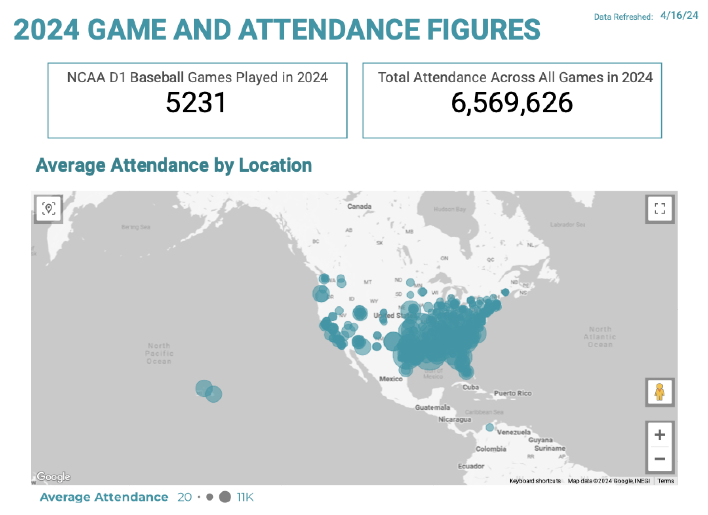
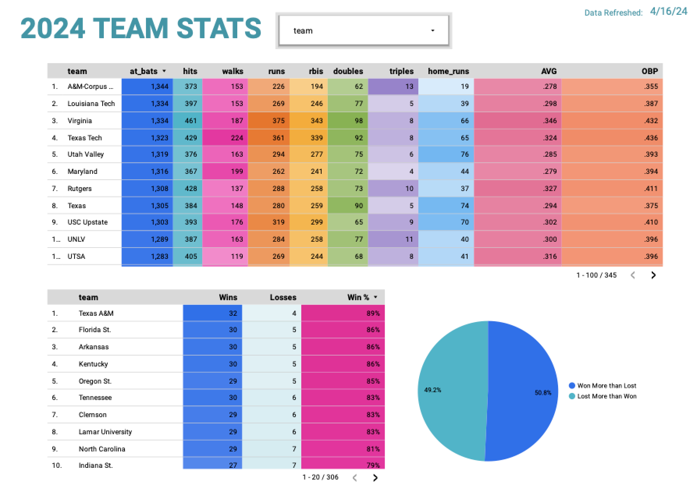
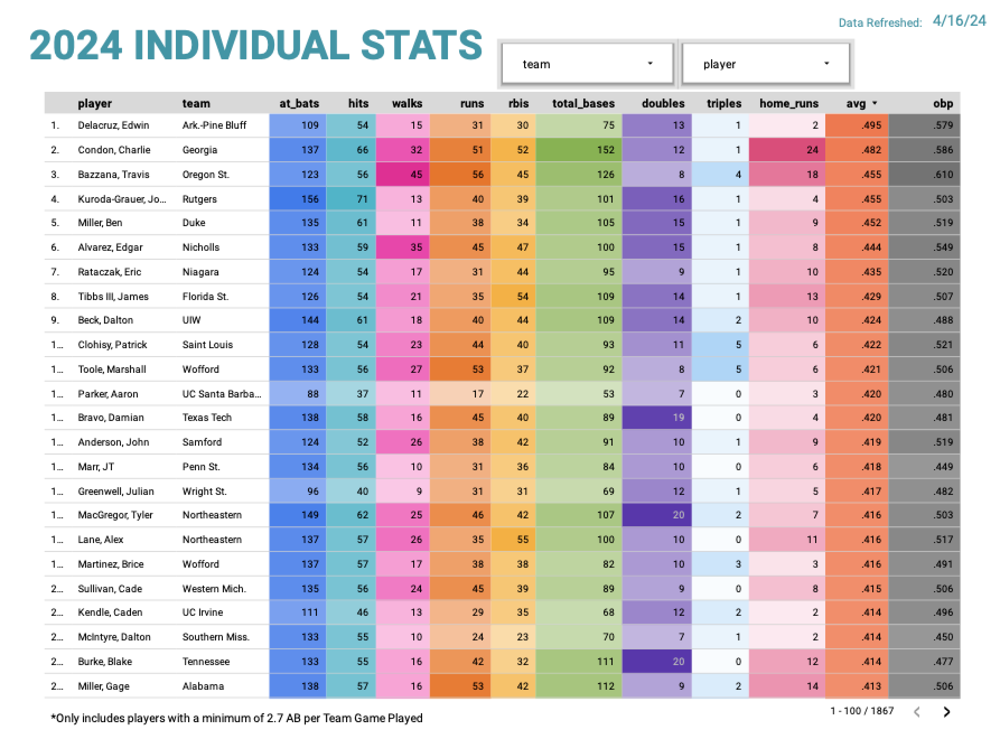
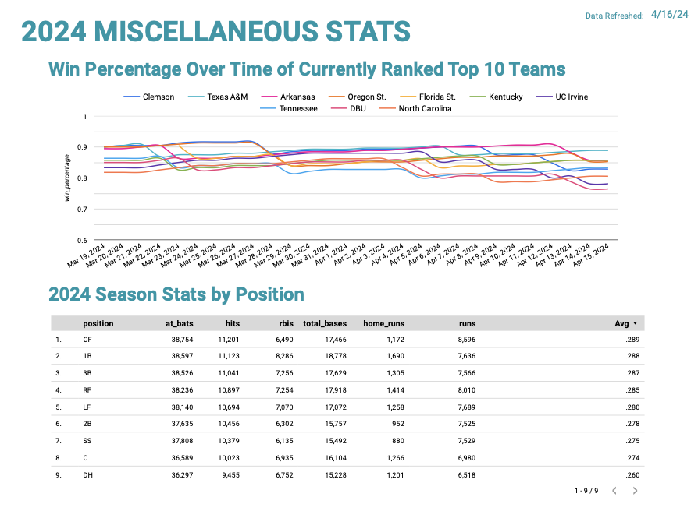

  

  

# NCAA Division 1 Baseball Stats Pipeline Setup

## Overview

  
This guide provides detailed instructions to replicate this project: an end-to-end data engineering pipeline that scrapes College Baseball Stats from the web, stores it in a Data Lake (Google Cloud Storage), pushes it to a Data Warehouse (BigQuery), transforms it using dbt, and builds a dashboard to visualize the data (Google Data Studio). The pipeline involves setting up resources on Google Cloud Platform using Terraform, and automating data flows through a dockerized instance of Mage containing python and sql code (dbt).

## Video With Project Setup Instructions

Link to video walkthrough of project setup [here](https://youtu.be/_jiDGqHllJU)


## Prerequisites

  

Before starting, ensure you have the following tools setup/installed on your local machine.

  
-  **Create a Google Cloud Platform (GCP) Account with Billing Setup**: If you do not already have a Google account, you will need to create one. Create an account [here](https://cloud.google.com/). Billing setup instructions [here](https://cloud.google.com/billing/docs/how-to/manage-billing-account)

  
  

-  **Git**: [Install Git for Windows](https://git-scm.com/download/win), [Install Git for Mac](https://git-scm.com/download/mac), For Linux: Use your package manager, e.g., for Ubuntu, run `sudo apt install git`

  

-  **Google Cloud SDK**: [Google SDK Installation](https://cloud.google.com/sdk/docs/downloads-interactive#linux-mac) skip the `gcloud init` step

  

-  **Terraform**: Links to [Install Terraform](https://learn.hashicorp.com/tutorials/terraform/install-cli)

  

-  **Make**: Usually pre-installed on machine

  
  

  

## 1. Download Project Repository

  

  

Navigate to your desired directory and clone the repository:

  

  

```bash
git  clone  https://github.com/beaubranton4/ncaa_d1_baseball_stats.git
cd  ncaa_d1_baseball_stats

```

  Rename the env_template to .env

  

## 2. Google Cloud Setup


### 2.1 Initialize Google Cloud Project

```bash
# Initialize your GCP configuration

gcloud  init  --no-browser  --skip-diagnostics
# Follow prompts:
# - Select Option 2 - to create a new configuration
# - Enter configuration name: ncaa-d1-baseball-stats-project
# - Choose the account you would like to use to perform operations for this configuration: (select your active email tied to GCP account)
# - Pick Cloud Project to Use: (Create New Project)
# - Please enter project id: ncaa-d1-baseball-stats-project

gcloud  config  get-value  project  # To Verify the correct project is set
```

You can also create a Google Cloud project in your web browser instead of through CLI.  

  

**WARNING:** Ensure you keep track of the project ID and Project Name that you use. If you set a different ID/Name, it is ok, but you will need to remember to update the environment variables in your `.env` file accordingly.

  

  

### 2.2 Update Environment Variables

  

  

Ensure the `env_template` is correctly renamed to `.env`.

  

In your `.env`:

- Update the `GCS_PROJECT_NAME` and `GCS_PROJECT_ID` variables to the name and ID you used to initialize your project in 2.1

- You must update `GCS_BUCKET_NAME` variable because all bucket names across all of GCS are unique. Adding a few numbers to the end should work.

- You can update the `GCP_REGION` and `GCP_ZONE` variable to somewhere closer to where you live if you'd like.

  

### 2.3 Enable Billing for the Project You Created

Go to [Google Cloud Console](https://console.cloud.google.com/) and select the project you created. Next go to [Billing](https://console.cloud.google.com/billing) and enable billing.

### 2.4 Create Service Account & Setup Access

  

  

Ensure Make is installed on your machine. Use the provided Makefile to setup the project:

  

In the parent directory of this project:

```bash
set  -o  allexport && source  .env && set  +o  allexport
make  gcp-set-all  # This will create the service account, configure IAM roles, download service account credentials to the credential folder
```

  

  

### 2.5 Generate SSH Keys

  

  

```bash
cd  ~/.ssh
ssh-keygen  -t  rsa  -b  2048  -f  ~/.ssh/ncaa_d1_baseball_stats  -C  project_user
```


## 3. Terraform Setup

  

  

Navigate to the project's Terraform directory and initialize and apply the configuration:

  

  

```bash
set  -o  allexport && source  .env && set  +o  allexport
terraform  -chdir=terraform  init
terraform  -chdir=terraform  plan
terraform  -chdir=terraform  apply
```

  

  

Confirm the setup by typing `yes` when prompted.

  

Presto! Your Data Lake, Data Warehouse and VM have been created.

  

  

## 4. SSH into VM

  

  

```bash
# Start the VM
gcloud  compute  instances  start  $GCP_VM_NAME  --zone  $GCP_ZONE  --project  $GCP_PROJECT_ID
```

Next, create a config file in your ~.ssh/ directory:

```
Host ncaa-d1-baseball-stats
Hostname [to be replaced with external IP Address of VM]
User project_user
IdentityFile ~/.ssh/ncaa_d1_baseball_stats
```

Remote-ssh into the VM.

For help, you can watch this [video](https://youtu.be/ae-CV2KfoN0?t=767) starting around 12:48. This is the best way to ssh into a VM as it will allow you to easily portforward if you're using VScode.

## 5. Setup on VM

  

  

Clone the project and prepare the environment on the VM:

  

  

```bash
git  clone  https://github.com/beaubranton4/ncaa_d1_baseball_stats.git
cd  ncaa_d1_baseball_stats
```

  

  

- Copy the .env file over from the project in your local machine to the project in the VM
- Copy the gcp-credentials.json in the credentials folder from the project in your local machine to the same location in the project on your VM

  NOTE: If you decide to skip this step, you must download docker and docker-compose on your machine manually to run the data pipelines in Mage locally

## 6. Running Mage via Docker-Compose

  

Docker and docker-compose should already be installed on the VM via Terraform.

While still in the parent directory of this project on your VM:

```bash
sudo  docker-compose  up
```

  

Enable Port Forwarding and connect to localhost:6789 in a web browser. You should see the UI for Mage.

## 7. Triggering Mage Pipelines via Mage UI

  

  

Access the Mage UI to run the pipelines.

  
  

1. Navigate to **Pipelines** in the left-hand menu where you'll find four pipelines:

-  `test_scrape_ncaa_d1_baseball_stats`

-  `scrape_ncaa_d1_baseball_stats`

-  `ncaa_batting_gcs_to_big_query`

-  `dbt_transform_ncaa_d1_baseball`

  

2. Choose a pipeline based on your time preference:

-  **Option 1: Quick Test: Scrape stats from first day of season** (Approx. 5 minutes)

- Select `test_scrape_ncaa_d1_baseball_stats`.

- Click **Run@once** then **Run Now**.

-  **Option 2: Full Season: Scrape all stats from season** (Approx. 2-3 hours)

- Select `scrape_ncaa_d1_baseball_stats`.

- Click **Run@once** then **Run Now**.

  
Both options will scrape NCAA stats and transfer the data to Google Cloud Storage. Upon completion of either pipeline, the subsequent pipelines (`ncaa_batting_gcs_to_big_query` and `dbt_transform_ncaa_d1_baseball`) will automatically run, loading and transforming the data: which will also transfer the data to BigQuery and transform it using dbt. You can confirm by checking the following:

  

-  **Google Cloud Storage**: You’ll find a bucket named per your `.env` file, containing folders for each date's data in parquet format.

-  **BigQuery**: 6 new tables will be created in the production dataset within you BQ project

  

### Automating Pipeline Execution

  

To keep the pipeline running regularly, set up a scheduled Mage trigger for `scrape_ncaa_d1_baseball_stats`. This automation ensures your data remains up-to-date, running the pipeline as often as needed while keeping in mind the associated costs.

  
  
  

  

## 8. Looker Dashboard Setup

  

You can create your own dashboard and connect it to your production data now available in BigQuery. This part of the project cannot be setup for you via code. Here is the [link](https://lookerstudio.google.com/s/nWiTVPz6SUw) to the dashboard for you to view as well as screenshots of the final project:

  







  
And that's all!

Below are resources for you to learn more if interested in building your own dashboard.

- [Looker Instance Setup](https://console.cloud.google.com/looker/instances?referrer=search&authuser=0&walkthrough_id=looker-studio--looker-studio-onboarding&project=ncaa-d1-baseball-stats-project)

- [Embedding Looker Dashboards](https://lookerstudio.google.com/s/nWiTVPz6SUw)

  

  

## 9. Destroy Resources

  

  

The final step is to clean up resources, as you won't want to be mistakenly billed for these. Navigate to the Terraform directory and run:

  

  

```bash
set  -o  allexport && source  .env && set  +o  allexport
terraform  -chdir=terraform  destroy
```
